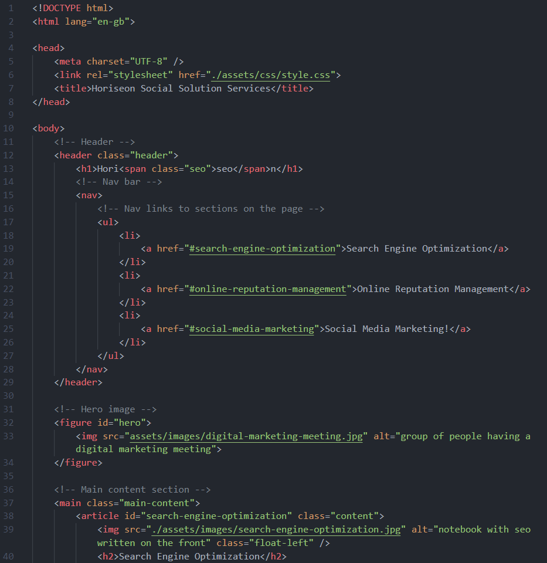

# bootcamp-week-1-challenge

## Description

For this project I was required to refactor the existing code for Horiseon, a fictional SEO specialist. In order for the site to meet accessibility standards and be optimised for search engines, the requirements stated that the html had to follow semantic guidelines, the css should be condensed and reorganised to follow the page semantics. 

### HTML Changes

Several div tags were removed and replaced:
- Added `<header>` tag
- Added `<nav>` tag
- Added `<figure>` tag
- Added `<main>` tag
- Added `<article>` tag
- Added `<aside>` tag
- Added `<section>` tag
- Added `<footer>` tag

An anchor link was missing for the "search-engine-optimization" section so this was added and the title of the webpage was amended to something more appropriate. 

The hero image was moved from the CSS file to the HTML file, allowing the use of an alt attribute to describe the image.

Alt attributes were added to all images for accessibility. 

### CSS Changes

The CSS file has been condensed by consolidating several classes into one, where appropriate. The CSS file was also re-organised to follow the semantic flow of the HTML. 

Comments were added throughout to ensure future collaborators are able to read and follow the code easily.

## Learning Points

Whilst working through the website, it was interesting to see how the previous code had been written and the level at which the CSS was broken down. I also learned a lot when trying to change the 'hero' image from being a background image in the CSS file to an image in the HTML where an 'alt' value could be applied to it. 

## Useful Information

The page is deployed on GitHub - [click here](https://rbrd87.github.io/bootcamp-week-1-challenge/)

The repository of the project is also hosted on GitHub - [click here](https://github.com/rbrd87/bootcamp-week-1-challenge)

## Screenshots

Finished website looks and acts the same.

A sample of the HTML code showing some of the refactoring, the use of semantic tags and comments to ensure the code is easier to read.

A sample of the refactored CSS code, which shows the consolidated classes, the reorganising to follow the semantic flow of the page and comments to ensure the code is readable.

## Badges

   
